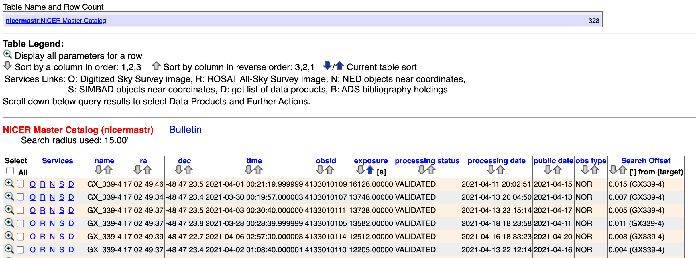
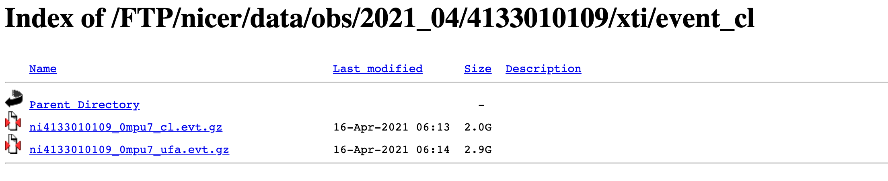
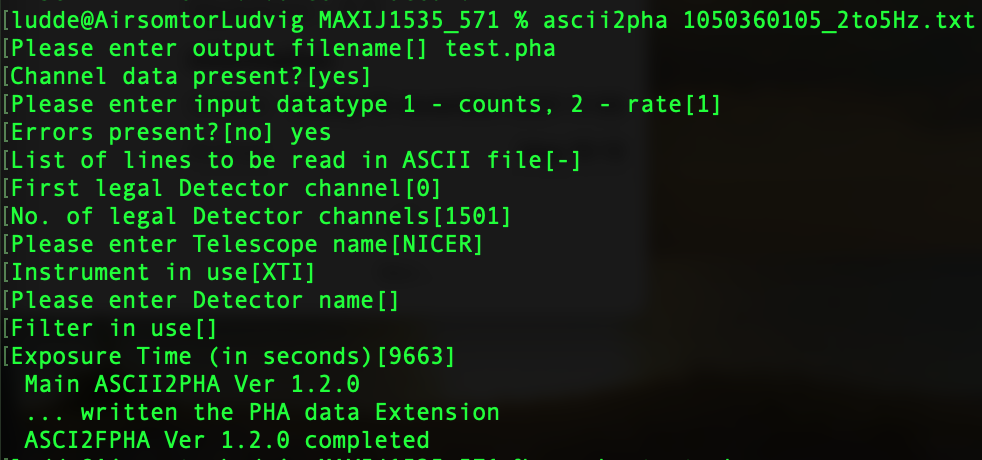

<h1>
  How to work with HEASOFT; XSELECT; XSPEC; nicerl2 etc
</h1>

What's the purpose of NICER? Have a look at: [NICER mission guide](https://sites.astro.caltech.edu/~srk/XC/Notes/NICER_Mission_Guide.pdf).

<h2> To download correct data: </h2>

1. Go to [NICER Archive](https://heasarc.gsfc.nasa.gov/docs/nicer/nicer_archive.html) and click on **[HEASARC Browse interface](https://heasarc.gsfc.nasa.gov/db-perl/W3Browse/w3table.pl?tablehead=name%3Dnicermastr&Action=More+Options)**. Alternatively, go directly to: [HEASARC Browse](https://heasarc.gsfc.nasa.gov/cgi-bin/W3Browse/w3browse.pl. Search for an object, e.g. GX339-4, and if successful, you'll get a data table:



2. Click on D under services.

3. Then go to: XTI Cleaned Data (event_cl):



4. Click on the *cl.evt.gz-file, which will direct you to: `https://heasarc.gsfc.nasa.gov/FTP/nicer/data/obs/2021_04/4133010109/xti/event_cl/ni4133010109_0mpu7_cl.evt.gz)`. Copy paste this link and run:

```
wget https://heasarc.gsfc.nasa.gov/FTP/nicer/data/obs/2021_10/4133010273/xti/event_cl/ni4133010273_0mpu7_cl.evt.gz
```

in the terminal. Or do `!wget *link*` if you want to download it directly within a jupyter notebook.

5. To unzip correctly, run:

```
gzip -dk filename.gz
```

6. You can then use the HeaSoft-package to extract **light curves** or **energy spectra**. If you want you can also run the star.extract_fits()-method to get the data:

```
extract_fits('ni4133010273_0mpu7_cl.evt')
```

<h2>Downloading HeaSoft</h2>

Step1: https://heasarc.gsfc.nasa.gov/lheasoft/download.html

Follow steps 1-3: pick **SOURCE CODE DISTRIBUTION**, then pick "All" packages, and then go to:

Step2 (on Mac): https://heasarc.gsfc.nasa.gov/lheasoft/macos.html

Se till att "XQuartz" samt "Homebrew" är installerade! Följ sedan  "Bourne shell variants (bash/sh/zsh)"-kolumnen.

**Följ instruktionerna och läs noga. Några saker som jag fastnade lite på:**

* Innan du kör alla EXPORT-kommandon, se till att alla filer finns på just de platser som angivits. Jag behövde ändra “export FC=/usr/local/bin/gfortran-11“ till “export FC=/usr/local/gfortran/bin/gfortran” etc.
* Tro inte att installationen är klar bara för att ny bash-rad finns tillgänglig; kör tail -f build.log för att se i realtid hur det går att bygga paketet. Råkade starta installation troligen innan build var klar… Återstår att se om det fungerade ändå… Man kan ju tycka att den borde slutföra första build-kommandot innan den kör installering :)

<h1> XSELECT </h1>

<h1> In terminal to extract lightcurves: </h1>

**To initialize software:**

Create environment HEADAS and source it(?):

```bash
export HEADAS=/Applications/heasoft-6.29/x86_64-apple-darwin21.1.0  

. $HEADAS/headas-init.sh
```

**To start software, e.g. xselect, just run:**

```bash
XSELECT
```

**Then you need to input:**

```
[session name] (does only matter if want to run several parallell sessions)
read events (to tell software to read an event file)
[enter directory] ("./" if you started the software in the correct directory)
[enter filename] (should be on form "*.evt"
yes (to the q: "Reset the mission?")
@script (e.g @../../HeaSoft/lc0p5_5ms.xco)
```

A script can look like:

```
set binsize 0.005  
set phaname PI

filter pha_cutoff 200 250  
extract curve  
save curve 2to2.5kev.lc    
```

The last 3 lines can then be repeated for all light curves to be extracted

Exit program by:

```
exit
```

Then the program will ask if you want to save the session (if yes, then you can continue that session later).

<h1> In terminal to extract spectrum: </h1>

Like above (for light curves), with the difference that we know need to specify the channels we want to extract the spectrum for (e.g. 0-1500 = 0-15 keV)

```
set phaname PI

filter pha_cutoff 0 1500  
extract spectrum  
save spectrum fullspec.pha   
```

If we want to filter time: skip "set phaname PI" for some reason...

To get the new times, first use:

```python
print_datetime_UT(obs_start,m,step,parts)
```

before running (in XSELECT):

```
filter pha_cutoff 0 1500  

filter time ut
[enter start and stop] > yyyy-mm-ddThh:mm:ss.sss, yyyy-mm-ddThh:mm:ss.sss
[enter start and stop] > x #to save and exit "filter time"
extract spectrum  
save spectrum fullspec_partX.pha

clear time all #clears the filter, otherwise you will have two filters next time
# and then repeat from filter time ut to filter next part

# save spectrum fullspec_part1.pha
# save spectrum fullspec_part2.pha
# save spectrum fullspec_part3.pha
# save spectrum fullspec_part4.pha
```

---

<h3>Info: </h3>

https://heasarc.gsfc.nasa.gov/lheasoft/macos.html
https://heasarc.gsfc.nasa.gov/docs/rosat/ros_xselect_guide/#tth_chAp2

<h1> XSPEC </h1>

Useful links:

* http://polywww.in2p3.fr/activites/physique/glast/workbook/pages/sciTools_latGrbAnalysis/2_runXSPEC_part01.html
* https://www.rri.res.in/~bpaul/asw/html/spec_exe1.html
* http://polywww.in2p3.fr/activites/physique/glast/workbook/pages/sciTools_latGrbAnalysis/example01_xspecHelp.html

<h2> How to make .pha-files correctly?</h2>

<u>Alternative 1</u>:

**In python**:

```
a = np.array([spectral_data['CHANNEL'], FRS, FRS_err])
mat = np.transpose(np.matrix(a))
with open(path-to+filename.txt,'wb') as f:
for line in mat:
    np.savetxt(f, line, fmt='%.0f')
```

**Then in bash**:

```
ascii2pha filename.txt
```

Note: answer the questions and that Errors present? will always have [no] as default, while the others will be remembered until next time.



Then run:

```
grppha filename.pha

group 0 1500 50
```

where filename.pha is the entered output filename from ascii2pha. The group-command then gives two extra columns (quality, grouping) to the .pha-file (a fits-file format).

<u>Alternative 2</u>:

Do everythin in **python** using FITS-format there... Should be possible... :)

Simply call:

```
frs2pha(spectral_data,FRS,FRS_err,grouping,save_path)
```

<h2> Model fitting and plotting of spectra</h2>

Start software, by simply runnning (if it doesn't work; try to source package in the same way as the first lines prior to the XSELECT-command above):

```
XSPEC
```

Open a figure

```
cpd /xw
```

Import the energy spectra

```
data filename.pha
```

It will tell you that no response has been loaded. So these files need to be downloaded and then we load them, e.g.:

```
resp nixtiref20170601v002.rmf

arf nixtiaveonaxis20170601v004.arf
```

or, in case that resp och arf has been combined into .rsp-file

```
response _.rsp
```

Then to ignore certain channels

```
ig 0-50, 1000-**
```

To plot the data

```
plot ldata
```

To fit a model to the data

```
model powerl

1:powerlaw:PhoIndex>1.6

2:powerlaw:norm>1
```

The main command to plot is then

```
plot eeuf
```

If need to override something, e.g. what channels to ignore, just rerun such a command:

```
ig 0-150
```

If want to notice some channels again

```
not 100-150
```

If we want to import another file, then we can do

```
data 2:2 test.pha
```

where 2:2 specifies the "channel" of the figure to use. We then need to use the response-files again, but now for this file, which we specify with a "2" for this "channel":

```
resp 2 nixtiref20170601v002.rmf  # and similar for the .arf-file
```

And a thrid example:

```
data 3:3 testg.pha

load response files as above...

ig 3: 1-3, 20-**
```

To show all data and then all model-parameters:

```
show data

show param
```

To change a param value:

```
new 7 1
```

Change param7 to value 1

To set plot:

```
setplot rebin 100 10

setplot energy
```

---

For simple modeling of X-ray binaries:

```
model wabs*(diskbb+nthcomp)
```

diskbb är en utsträckt svartkropp som passa ackretionsskivor. Den har bara två parametrar (innertemperatur - ca 0.5 keV - och normering).

För nthcomp kommer du behöva ange flera parametrar:

* Gamma (lutningen, samma som för en power-law)
* kT_e (elektrontemperaturen. Kan frysas till 100 keV.)
* kT_bb (temperauren på inkommande fotoner. Kan knytas till Tin i diskbb.)
* inp_type: låt vara 0
* Redshift: låt vara 0
* norm: normering

För att knyta två parametrar, ta “show par” och se vilket nummer den parameter du vill knyta till har (t.ex. 2). Om du sedan vill knyta en annan parameter (säg 6) till den skriver du “new 6 = 2”.

Vill du frysa en parameter skriver du “fre N”, där N är numret på parametern du vill frysa.

# CALDB, e.g. for making arf and rmf files

https://heasarc.gsfc.nasa.gov/docs/nicer/analysis_threads/arf-rmf/

Start by sourcing CALDB:

```bash
export CALDB=/Applications/heasoft-6.29/caldb
source $CALDB/software/tools/caldbinit.csh
```

Make sure you have **data** for the correct mission and instrument; check at:

> https://heasarc.gsfc.nasa.gov/docs/heasarc/caldb/install.html  

If does not work, just run:

```bash
export CALDB=/Applications/heasoft-6.29/caldb
export CALDBCONFIG=$CALDB/software/tools/caldb.config
export CALDBALIAS=$CALDB/software/tools/alias_config.fits
```

Run:

```
nicerarf fullspec.pha 275.0915000 7.1853889 ni1200120103.mkf ni1200120103.mkf nixtia1200120103.arf outwtfile=nixtia1200120103_wt.lis
```

where

* fullspec.pha is the spectrum generated by XSELECT
* 275.0915000 7.1853889 is RA and DEC in J2000 (can be found in the Hesarc archive, e.g. by clicking at **O** to get RA and DEC in J2000 (is displayed in hrs and deg at the main page))
* ni1200120103.mkf is the filter file, which we can download at the Heasarc archive by going into **D** and then into the auxil-folder
* nixtia1200120103.arf is the output arf-file
* outwtfile=nixtia1200120103_wt.lis is a file needed by the rmf-generation

**NOTE:** according to https://heasarc.gsfc.nasa.gov/docs/nicer/analysis_threads/arf-rmf/ we should use the cleaned event file ni1200120103_0mpu7_cl.evt instead of the first ni1200120103.mkf. But according to https://www.youtube.com/watch?v=mRlH17R0bmY and https://heasarc.gsfc.nasa.gov/lheasoft/ftools/headas/nicerarf.html the .mkf-file should be put there twice?

Then, for rmf:

```
nicerrmf fullspec.pha ni1200120103.mkf nixtir1200120103.rmf detlist=@nixtia1200120103_wt.lis
```

**DOES NOT WORK...**

# If no cleaned data - extract cleaned data using **nicerl2**

* First: need to extract "Full Observation Dataset" as tar-file from HeaSarc, then:

https://heasarc.gsfc.nasa.gov/lheasoft/ftools/headas/nicerl2.html

* Need to "export" (source) CALDB-package (see above or here below):

  ```bash
  export HEADAS=/Applications/heasoft-6.29/x86_64-apple-darwin21.1.0  

  . $HEADAS/headas-init.sh

  export CALDB=/Applications/heasoft-6.29/caldb
  export CALDBCONFIG=$CALDB/software/tools/caldb.config
  export CALDBALIAS=$CALDB/software/tools/alias_config.fits
  ```

  and then:

```
nicerl2 indir=OBSERVATION_ID clobber=YES
# e.g. nicerl2 indir=4133010105 clobber=YES
```

* indir = path to directory with all data! E.g. "Full Observation Dataset (1200120224)" (HeaSarc)
* clobber = YES = needed to overwrite files
